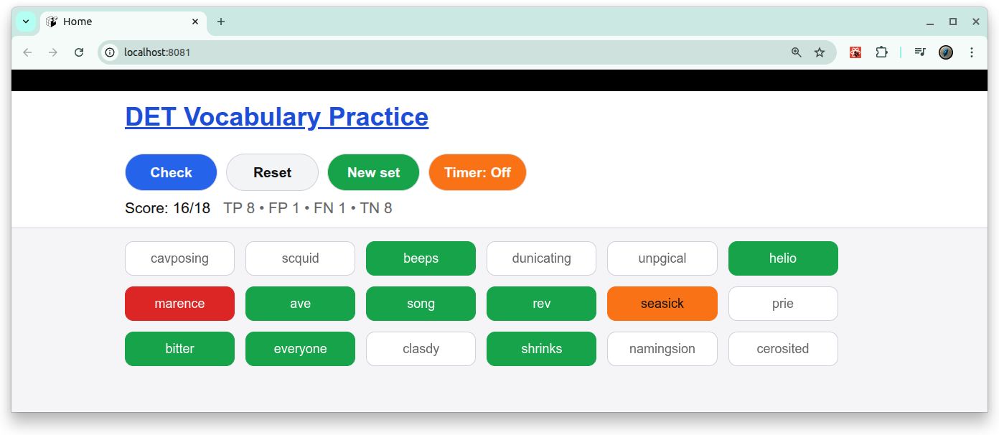

# [DET Vocabulary](https://github.com/europanite/det_vocabulary "DET Vocabulary")

A Duolingo English Test Vocabulary Section Playground.



## PlayGround

 [DET Vocabulary](https://europanite.github.io/det_vocabulary/)

Choose real English words and press the "Check" button.

---

## Getting Started

### 1. Prerequisites
- [Docker](https://www.docker.com/) & [Docker Compose](https://docs.docker.com/compose/)

### 2. Build and start all services:

```bash
# set environment variables:
export REACT_NATIVE_PACKAGER_HOSTNAME=${YOUR_HOST}

# Build the image
docker compose build

# Run the container
docker compose up
```

### 3. Test:
```bash
docker compose \
-f docker-compose.test.yml \
up --build --exit-code-from \
frontend_test
```

---

# License
- Apache License 2.0